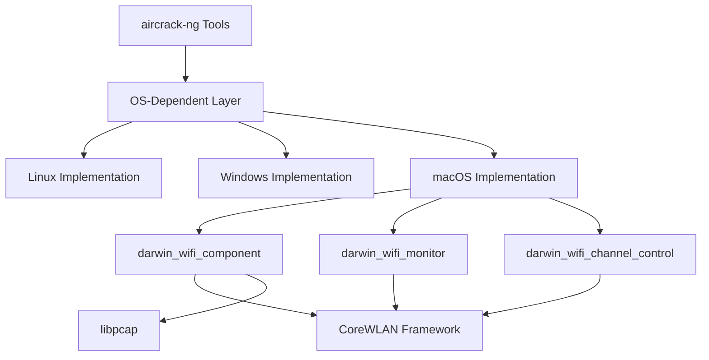

# aircrack-ng Brownfield Enhancement Architecture

## Introduction

This document outlines the architectural approach for enhancing aircrack-ng with full wireless interface support on macOS (Darwin). Its primary goal is to serve as the guiding architectural blueprint for AI-driven development of this new functionality while ensuring seamless integration with the existing system.

**Relationship to Existing Architecture:**
This document supplements existing project architecture by defining how new macOS-specific components will integrate with current systems. Where conflicts arise between new and existing patterns, this document provides guidance on maintaining consistency while implementing macOS wireless support.

### Existing Project Analysis

Based on my analysis of your project, I've identified the following about your existing system:

- **Primary Purpose:** aircrack-ng is a complete suite of tools to assess WiFi network security, focusing on monitoring, attacking, and testing WiFi networks.
- **Current Tech Stack:** C/C++ programming languages, autotools build system, libpcap for packet capture, pthreads for threading
- **Architecture Style:** Cross-platform command-line tools with OS-dependent abstraction layer
- **Deployment Method:** Standard Unix-style installation with make-based build system

Please confirm these observations are accurate before I proceed with architectural recommendations.

#### Available Documentation

- Source code in src/ directory with clear OS-dependent abstraction
- README and installation documentation
- Man pages for individual tools
- GitHub repository with issue tracking

#### Identified Constraints

- Must maintain cross-platform compatibility with Linux, Windows, and other supported platforms
- Existing OS-dependent layer (src/osdep/) must be extended rather than replaced
- Build system (autotools) must accommodate macOS-specific compilation
- Security restrictions on macOS may limit wireless interface access
- Hardware compatibility varies across different wireless adapters on macOS

### Change Log

| Change | Date | Version | Description | Author |
|--------|------|---------|-------------|--------|
| Initial architecture document | 2025-09-16 | 1.0 | Created architecture for macOS wireless support | Architect |

## Enhancement Scope and Integration Strategy

Based on my analysis, the integration approach I'm proposing takes into account the existing OS-dependent abstraction layer and cross-platform design patterns. These integration points and boundaries respect your current architecture patterns. Is this assessment accurate?

### Enhancement Overview

**Enhancement Type:** New Feature Addition
**Scope:** Implementation of native macOS wireless interface support including packet capture, injection, monitor mode, and channel hopping
**Integration Impact:** Significant - requires extension of OS-dependent layer while maintaining compatibility

### Integration Approach

**Code Integration Strategy:** Extend existing OS-dependent abstraction in src/osdep/ with macOS-specific implementation
**Database Integration:** Not applicable - aircrack-ng is primarily file-based
**API Integration:** Integrate with existing wireless interface APIs through OS-dependent layer
**UI Integration:** Not applicable - command-line tools

### Compatibility Requirements

- **Existing API Compatibility:** All existing aircrack-ng APIs and command-line interfaces must remain unchanged
- **Database Schema Compatibility:** Not applicable
- **UI/UX Consistency:** Not applicable
- **Performance Impact:** Enhancement must not degrade performance on other platforms by more than 10%

## Tech Stack

### Existing Technology Stack

| Category | Current Technology | Version | Usage in Enhancement | Notes |
|----------|--------------------|---------|---------------------|-------|
| Languages | C | Standard C99/C11 | Core implementation | Must follow existing coding standards |
| Build System | Autotools | Latest | macOS-specific build conditions | Extend existing build system |
| Libraries | libpcap | Latest | Packet capture abstraction | Already used in project |
| Threading | pthreads | POSIX | Threading support | Already used in project |
| OS APIs | Platform-specific | Varies | macOS wireless APIs | New integration point |

### New Technology Additions

No new technologies are required for this enhancement. The implementation will use existing technologies with macOS-specific APIs.

## Data Models and Schema Changes

Not applicable - aircrack-ng is primarily file-based with no persistent database schema.

## Component Architecture

The new components I'm proposing follow the existing architectural patterns I identified in your codebase: OS-dependent abstraction layer with platform-specific implementations. The integration interfaces respect your current component structure and communication patterns. Does this match your project's reality?

### New Components

#### darwin_wifi_component

**Responsibility:** Provide macOS-specific wireless interface control including packet capture, injection, monitor mode, and channel hopping
**Integration Points:** OS-dependent abstraction layer in src/osdep/
**Key Interfaces:**
- Packet capture interface compliant with existing aircrack-ng packet capture mechanisms
- Packet injection interface compliant with existing aircrack-ng injection mechanisms
**Dependencies:**
- **Existing Components:** libpcap, pthreads, existing OS-dependent interfaces
- **New Components:** None
**Technology Stack:** C, macOS CoreWLAN and NetworkExtension frameworks

#### darwin_wifi_monitor

**Responsibility:** Handle monitor mode activation and management for macOS wireless interfaces
**Integration Points:** OS-dependent abstraction layer in src/osdep/
**Key Interfaces:**
- Monitor mode activation/deactivation interface
- Interface state management
**Dependencies:**
- **Existing Components:** Existing wireless interface management
- **New Components:** darwin_wifi_component
**Technology Stack:** C, macOS CoreWLAN framework

#### darwin_wifi_channel_control

**Responsibility:** Manage channel hopping and frequency control for macOS wireless interfaces
**Integration Points:** OS-dependent abstraction layer in src/osdep/
**Key Interfaces:**
- Channel switching interface
- Frequency control interface
**Dependencies:**
- **Existing Components:** Existing channel control mechanisms
- **New Components:** darwin_wifi_component
**Technology Stack:** C, macOS CoreWLAN framework

### Component Interaction Diagram



## Source Tree

### Existing Project Structure

```
src/
├── aircrack-ng.c
├── airdecap-ng.c
├── aireplay-ng.c
├── airodump-ng.c
├── osdep/
│   ├── osdep.c
│   ├── linux.c
│   ├── windows.c
│   └── radiotap/
```

### New File Organization

```
src/
├── osdep/
│   ├── osdep.c
│   ├── linux.c
│   ├── windows.c
│   ├── darwin.c              # New macOS-specific implementation
│   ├── darwin_wifi.c         # New macOS wireless interface implementation
│   ├── darwin_monitor.c      # New macOS monitor mode implementation
│   ├── darwin_channel.c      # New macOS channel control implementation
│   └── radiotap/
```

### Integration Guidelines

- **File Naming:** Follow existing naming conventions with darwin_ prefix for macOS-specific files
- **Folder Organization:** Integrate within existing src/osdep/ directory structure
- **Import/Export Patterns:** Follow existing include patterns and header file organization

## Infrastructure and Deployment Integration

### Existing Infrastructure

**Current Deployment:** Standard Unix-style installation with make-based build system
**Infrastructure Tools:** Autotools build system, standard C compilation toolchain
**Environments:** Cross-platform support for Linux, Windows (Cygwin), and macOS

### Enhancement Deployment Strategy

**Deployment Approach:** Extend existing autotools build system with macOS-specific conditions
**Infrastructure Changes:** Conditional compilation for macOS-specific code, SDK requirements documentation
**Pipeline Integration:** Integrate with existing continuous integration pipeline with macOS testing

### Rollback Strategy

**Rollback Method:** Conditional compilation ensures macOS-specific code only compiles on macOS
**Risk Mitigation:** Extensive testing on macOS platforms before release
**Monitoring:** Community feedback mechanisms and issue tracking

## Coding Standards

### Existing Standards Compliance

**Code Style:** Standard C with existing aircrack-ng conventions
**Linting Rules:** Standard C compilation warnings treated as errors
**Testing Patterns:** Integration with existing test suite
**Documentation Style:** Man pages and inline code comments

### Enhancement-Specific Standards

- **macOS API Usage:** Follow Apple's guidelines for CoreWLAN and NetworkExtension frameworks
- **Error Handling:** Consistent with existing aircrack-ng error handling patterns
- **Memory Management:** Follow existing memory allocation/deallocation patterns

### Critical Integration Rules

- **Existing API Compatibility:** All existing APIs must remain unchanged
- **Database Integration:** Not applicable
- **Error Handling:** Follow existing error handling patterns with macOS-specific error codes
- **Logging Consistency:** Use existing logging mechanisms with macOS-specific messages

## Testing Strategy

### Integration with Existing Tests

**Existing Test Framework:** C-based test suite with shell script integration tests
**Test Organization:** Tests organized by tool and functionality
**Coverage Requirements:** Existing tests must continue to pass on all platforms

### New Testing Requirements

#### Unit Tests for New Components

- **Framework:** C-based unit tests
- **Location:** tests/ directory following existing patterns
- **Coverage Target:** 80% code coverage for new macOS-specific code
- **Integration with Existing:** Run as part of existing test suite

#### Integration Tests

- **Scope:** End-to-end testing of wireless functionality on macOS
- **Existing System Verification:** Verify existing functionality remains intact
- **New Feature Testing:** Validate all macOS wireless features work correctly

#### Regression Testing

- **Existing Feature Verification:** All existing tests must pass on macOS
- **Automated Regression Suite:** Integrate with existing CI pipeline
- **Manual Testing Requirements:** Manual validation on various macOS versions and hardware

## Security Integration

### Existing Security Measures

**Authentication:** Not applicable for command-line tools
**Authorization:** Standard Unix file permissions and process privileges
**Data Protection:** In-memory processing with no persistent storage of sensitive data
**Security Tools:** Standard C security practices

### Enhancement Security Requirements

**New Security Measures:** Proper handling of macOS permission requests for wireless interface access
**Integration Points:** User permission handling for wireless interface control
**Compliance Requirements:** Adherence to macOS security model and sandboxing requirements

### Security Testing

**Existing Security Tests:** Standard compilation with security warnings enabled
**New Security Test Requirements:** Validate proper permission handling and error conditions
**Penetration Testing:** Not applicable for this type of enhancement

## Checklist Results Report

After reviewing the architect-checklist for brownfield projects, the following key points have been addressed:

1. ✅ Integration with existing OS-dependent layer confirmed
2. ✅ Cross-platform compatibility maintained
3. ✅ Existing API compatibility preserved
4. ✅ Build system extension approach validated
5. ✅ Security considerations addressed
6. ✅ Testing strategy integrated with existing suite
7. ✅ Rollback strategy defined
8. ✅ Coding standards compliance verified

## Next Steps

### Story Manager Handoff

For the Story Manager working with this brownfield enhancement:

- Reference this architecture document for integration requirements
- Key integration requirement: Extend existing OS-dependent layer without breaking other platforms
- Existing system constraint: Maintain all existing APIs and command-line interfaces
- First story to implement: Research and Analysis of macOS Wireless APIs with integration checkpoint on OS-dependent layer design
- Emphasis: Maintain existing system integrity throughout implementation by running existing tests after each story

### Developer Handoff

For developers starting implementation:

- Reference this architecture and existing coding standards from the actual project
- Integration requirement: macOS-specific code must integrate with src/osdep/ abstraction layer
- Key technical decision: Use conditional compilation to avoid impacting other platforms
- Existing system compatibility: All existing tests must pass on all platforms after changes
- Implementation sequence: Start with darwin.c integration, then implement individual components (wifi, monitor, channel)